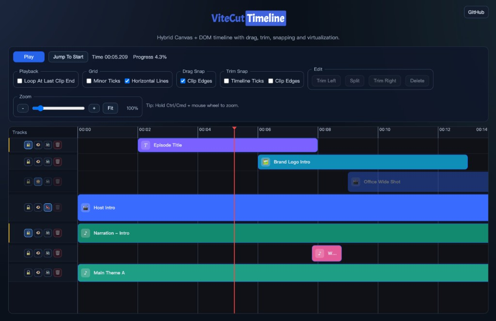

[English](README.md) | **简体中文**

<p align="center">
  
</p>

一个面向 Web 视频编辑器场景的 React 时间轴组件，采用 Canvas + DOM 混合渲染，支持拖拽、裁剪、分割、吸附、缩放与虚拟化渲染。

- 在线演示：[https://timeline.vitecut.com/](https://timeline.vitecut.com/)
- GitHub 仓库：[https://github.com/heyanpeng/ViteCutTimeline](https://github.com/heyanpeng/ViteCutTimeline)

## 截图预览

<p align="center">
  
</p>

## 特性

- Canvas + DOM 混合渲染，兼顾交互精度与复杂时间轴性能
- 轨道/片段拖拽，支持跨轨道移动与自动创建轨道
- 左右裁剪（Trim），支持吸附到片段边缘与时间刻度
- 播放头驱动编辑：按播放头分割、向播放头裁剪、删除选中片段
- 时间缩放与 `fitToContent` 自适应视图
- 轨道级控制：锁定、隐藏、静音、删除（主轨保护）
- 大数据量场景下的可见区域虚拟化渲染
- 键盘快捷编辑（例如 `Cmd/Ctrl + B` 分割、`[` / `]` 裁剪）

## 安装

```bash
npm install vite-cut-timeline
```

## 快速开始

```tsx
import { useRef, useState } from "react";
import { Timeline, type TimelineRef } from "vite-cut-timeline";
import type { TimelineRow } from "vite-cut-timeline";

const DURATION = 120;

const initialRows: TimelineRow[] = [
  {
    id: "main-video",
    name: "Main Video",
    role: "main",
    actions: [
      {
        id: "clip-1",
        effectId: "video",
        start: 0,
        end: 12,
        kind: "video",
        title: "Intro",
      },
    ],
  },
];

export default function Example() {
  const timelineRef = useRef<TimelineRef | null>(null);
  const [editorData, setEditorData] = useState<TimelineRow[]>(initialRows);
  const [playing, setPlaying] = useState(false);
  const [time, setTime] = useState(0);
  const [zoom, setZoom] = useState(1);

  return (
    <Timeline
      ref={timelineRef}
      editorData={editorData}
      duration={DURATION}
      playing={playing}
      currentTime={time}
      onEditorDataChange={setEditorData}
      onPlayingChange={setPlaying}
      onTimeChange={setTime}
      zoom={zoom}
      onZoomChange={setZoom}
      dragSnapToClipEdges
      trimSnapToClipEdges
      trimSnapToTimelineTicks
    />
  );
}
```

## 本地开发

```bash
npm install
npm run dev
```

## 贡献

欢迎提交 Issue 和 PR。

## 许可证

计划采用 MIT。  
如果你计划公开分发，建议在仓库根目录添加 `LICENSE` 文件。
